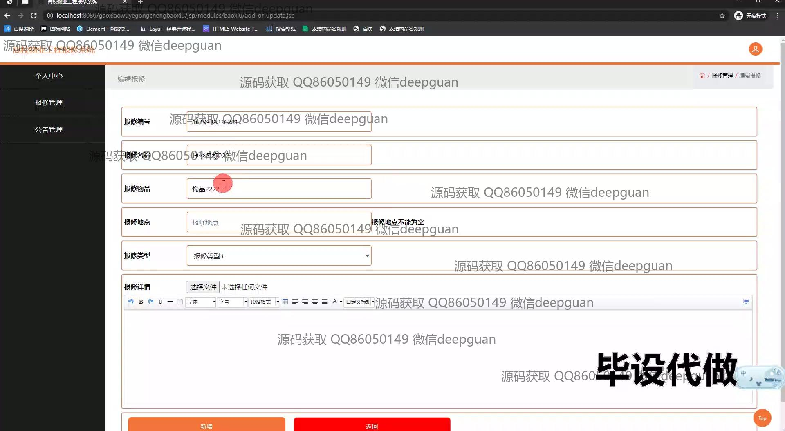

<h1 align="center">基于Java的高校物业工程报修系统+jsp</h1>

## 简介
高校物业工程报修系统：角色分为管理员、用户和工程师；功能包括报修管理、公告管理、用户管理、工程师管理、个人中心；界面采用SSM框架和JSP技术。    --计算机毕业设计源码；毕设源码；java毕业设计源码

## 联系方式

<h3 align="center">获取完整代码与数据库文件 + 微信：deepguan QQ: 86050149 QQ群: 783742310</h3>

<h3 align="center">可帮忙远程部署 包运行成功！提供远程部署、修改代码、设计文档指导、代码讲解等服务！</h3>

## 功能介绍（完整见运行截图）
管理员：具备登录和注册功能，可通过系统的登录页面进入管理界面。管理员能够查看、编辑和管理工程师和用户信息，并进行公告管理和报修管理操作，包括编辑公告、接单和查看报修记录。系统提供搜索和过滤功能，方便管理员快速找到所需信息。管理员还可重置密码、修改公告和处理各类物业报修请求，以确保高效流程管理。

工程师：可以通过登录页面以工程师身份进入系统。登录后，工程师能够查看个人信息和管理自己的报修任务。系统提供详细的报修信息，包括用户姓名、联系方式、报修详情和报修时间。工程师可以选择接单或标记维修完成，上传头像和修改个人信息，通过这些功能提供对自身工作的全面管理和控制。

用户：用户通过登录界面以普通用户身份进入系统，可以提交新的报修请求。用户需要填写报修编号、名称、物品、地点和类型，并可查看已提交的报修记录。系统为用户提供简单清晰的导航菜单，包括个人信息管理和查看已提交的报修详情。用户还可在首页查看公告和物业相关信息，提高系统的易用性和便捷性。

## 运行截图

本代码来源于网络,仅供学习参考使用!

